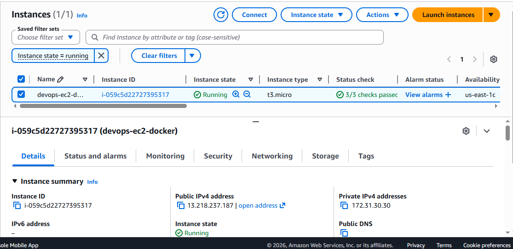
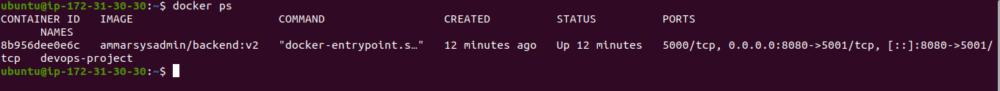
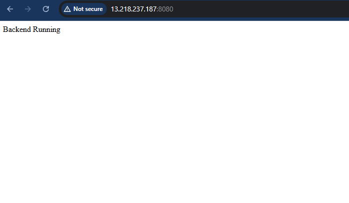

# aws-docker-ec2-deployment# 🚀 AWS EC2 Docker Deployment

## 📌 Overview

This project demonstrates deploying a containerized application on AWS EC2 using Docker.

It showcases real-world cloud deployment skills including EC2 setup, Docker containerization, security configuration, and application exposure via public IP.

---

## 🛠️ Tech Stack

- AWS EC2 (Ubuntu)
- Docker
- Linux (Ubuntu)

---

## ⚙️ Deployment Steps

### 1. Launch EC2 Instance
- Ubuntu 22.04 (t2.micro)
- Configure Security Group (Ports: 22, 8080)

### 2. Connect to EC2

```bash
ssh -i devops.pem ubuntu@13.218.237.187
```

---

### 3. Install Docker

```bash
sudo apt update -y
sudo apt install docker.io -y
sudo systemctl start docker
sudo systemctl enable docker
```

---

### 4. Run Application Container

```bash
docker run -d -p 8080:5001 yourdockerhubusername/your-image
```

---

## 🌐 Access Application

```
http://13.218.237.187:8080
```

---

## 📸 Screenshots

### EC2 Instance Running


### Docker Container Running


### Application in Browser


---

## 🧠 Key Learnings

- AWS EC2 instance setup
- Security group configuration
- Docker container deployment
- Port mapping and troubleshooting
- Cloud-based application hosting

---

## 👨‍💻 Author

Muhammad Ammar – Junior DevOps Engineer# aws-docker-ec2-deployment
# aws-docker-ec2-deployment
